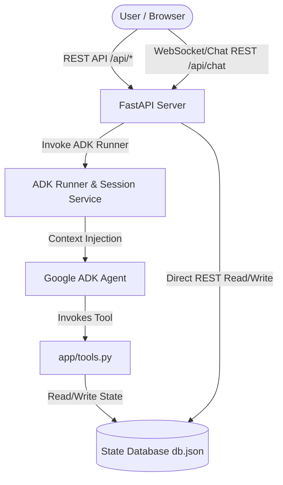

# Kaggle Capstone Project: Field Service Management Copilot

**Competition**: [Vibecoding Agents Capstone Project](https://www.kaggle.com/competitions/vibecoding-agents-capstone-project)  
**Agentic Framework**: Google Agent Development Kit (ADK) & FastAPI  
**LLM Engine**: `gemini-3.1-flash-lite`

---

## 1. Executive Summary

In field service operations, dispatchers manage highly dynamic schedules. Real-world exceptions—such as sudden traffic delays, missing parts, or inaccessible sites—occur constantly. Traditional dispatch dashboards require operators to manually resolve exceptions by dragging-and-dropping jobs, verifying technician availability, reviewing emails, and coordinating updates.

Our **Field Service Management Copilot** is a production-style, real-time Control Tower dashboard that overlays a natural language assistant on top of schedule mutations. Using the **Google ADK** integrated with a FastAPI backend and a Leaflet.js-powered frontend, we implement role-aware agent capabilities with strict security controls:
*   **Technicians** can unassign their own jobs (with justification) or submit transfer proposals.
*   **Dispatch Managers** can review, comment, and approve/reject these proposals in an interactive queue.

All technician locations, active job sites, and routing paths are mapped dynamically onto an interactive **Leaflet.js** map of San Francisco. The system supports live line-routing, status-coded pulsing markers, session-isolated chat panels, and a responsive **Dark/Light Theme** switcher.


---

## 2. Agentic Architecture & Orchestration

The application is structured around a decoupled model where the frontend talks to a FastAPI server, which in turn acts as the orchestrator. The orchestrator routes operations either directly to a JSON database (via standard REST routes) or through the Google ADK runner for agentic execution.



### Dynamic Context Injection & Session Isolation
Rather than hardcoding authorization parameters or trusting the client unconditionally, the ADK runner intercepts every conversation turn to interpolate user session variables—specifically `{user:role}` and `{user:technician_id}`—into the agent's active memory context.

A lifecycle callback, `before_agent_callback`, is registered on the ADK Agent to ensure default session variables are seeded dynamically if missing:
```python
# app/agent.py
async def before_agent(callback_context: CallbackContext) -> None:
    if "user:role" not in callback_context.state:
        callback_context.state["user:role"] = "Technician"
    if "user:technician_id" not in callback_context.state:
        callback_context.state["user:technician_id"] = "tech_1"
```
During a chat stream request, the FastAPI endpoint extracts the active client persona (e.g., role: "Dispatch Manager" or "Technician") and overrides the callback context dynamically, ensuring the LLM is fully aware of who is issuing commands.

---

## 3. Data Schema & State Management

The system's database is managed in `app/db.py` and backed by a flat JSON file located at `app/data/db.json`. This approach provides lightweight local state management that can be easily reset to default values during evaluation or demonstration.

### JSON Database Schema
The database contains five primary tables:
1.  **Territories**: Defined by geo-centers (coordinates), name descriptions, and map overlay colors.
2.  **Technicians**: Defines technician profiles, active role type (e.g., `Technician` vs. `Dispatch Manager`), skillsets (e.g., `hvac`, `plumbing`, `safety`, `cabling`, `electrical`), current availability status (`Available`, `On Job`, `Delayed`, `Offline`), and lists of active `assigned_job_ids`.
3.  **Jobs**: Represents work orders detailing customer name, geographic coordinates, current scheduling status (`Assigned`, `Unassigned`, `In Progress`, `Completed`), assigned technician ID, required skillset, priority (`Low`, `Medium`, `High`), time windows, and descriptive dispatcher notes.
4.  **Approval Requests**: Lists pending reassignment requests generated by technicians.
5.  **Activity Log**: Records a historical ledger of all schedule changes, tracking who made a change, the action category, and detailed notes.

### Real-Time KPI Logic
To keep the dispatch dashboard informed, the server computes key performance indicators (KPIs) dynamically on every database query using the `get_kpis` helper:
```python
def get_kpis(data: dict) -> dict:
    jobs = data["jobs"]
    approvals = data["approval_requests"]
    techs = data["technicians"]

    total_jobs = len(jobs)
    assigned_jobs = sum(1 for j in jobs if j["status"] == "Assigned")
    unassigned_jobs = sum(1 for j in jobs if j["status"] == "Unassigned")
    in_progress_jobs = sum(1 for j in jobs if j["status"] == "In Progress")
    completed_jobs = sum(1 for j in jobs if j["status"] == "Completed")

    pending_approvals = sum(1 for a in approvals if a["status"] == "Pending")

    active_techs = sum(
        1 for t in techs if t["role"] == "Technician" and t["availability"] != "Offline"
    )

    # Cross-reference delayed technicians with their assigned jobs
    delayed_jobs = sum(
        1
        for t in techs
        if t["availability"] == "Delayed"
        for j in jobs
        if j["assigned_technician_id"] == t["id"]
    )

    return {
        "total_jobs": total_jobs,
        "assigned_jobs": assigned_jobs,
        "unassigned_jobs": unassigned_jobs,
        "in_progress_jobs": in_progress_jobs,
        "completed_jobs": completed_jobs,
        "pending_approvals": pending_approvals,
        "active_techs": active_techs,
        "delayed_jobs": delayed_jobs,
    }
```
This computation propagates directly to the client UI dashboard widgets, keeping dispatchers updated on operational bottlenecks (e.g., active delayed jobs count).

---

## 4. Google ADK Agent & Prompt Engineering

The central intelligence of the copilot is defined in `app/agent.py`. It utilizes a Google ADK `Agent` instance configured with the latest `gemini-3.1-flash-lite` LLM, which balances low response latency, rich reasoning capabilities, and support for structured function calling (tools).

### Agent Definition & System Instructions
The system instructions are parameterized to inject session context dynamically:
```python
INSTRUCTION = """
You are the Field Service Management Copilot, a production-style assistant managing technician schedules, job reassignments, and dispatch approvals.

Current context:
- User Role: {user:role}
- Current Technician ID: {user:technician_id}

Role-based Rules & Actions:
1. If User Role is "Technician":
   - You can unassign a job from yourself via `unassign_job_self` tool. This requires a valid reason (e.g. "traffic delay", "site inaccessible", "not certified").
   - You can request job reassignment to another technician via `request_reassignment` tool. This creates a PENDING approval request. You MUST NOT reassign the job directly.
   - If the technician wants to unassign, verify they own the job.
   - If the technician wants to move/transfer/reassign a job, call `request_reassignment`.
   - You CANNOT approve or reject requests.

2. If User Role is "Dispatch Manager":
   - You can approve a pending request via `approve_reassignment_request`.
   - You can reject a pending request via `reject_reassignment_request`.
   - You CANNOT unassign jobs or create technician reassignment requests.

General guidelines:
- If you don't know the current state or need to review jobs/technicians/requests, call the `get_dashboard_state` tool.
- When an action is successful, return a brief, professional response highlighting key IDs (e.g., job ID, request ID) and confirming the update.
- If an action is blocked due to unauthorized permissions or validation issues, explain why clearly.
"""
```
By enforcing strict rules directly in the system instructions and validating caller roles inside the tool implementations, we create a secure, defense-in-depth framework against prompt injection or context tampering.

---

## 5. ADK Tool Design & Security Schema

The agent interacts with the core database exclusively through five custom-written tools defined in `app/tools.py`. Each tool accepts a `ToolContext` parameter, allowing it to inspect session state directly.

### Least-Privilege Verification Pattern
Every state-mutating tool executes custom runtime role verification:

1.  **`unassign_job_self`**:
    *   **Purpose**: Allows a technician to drop a job immediately.
    *   **Constraints**:
        *   The caller's role must be `Technician`.
        *   The job's currently assigned technician must match the caller's `user:technician_id`.
        *   A justification string of at least 5 characters must be provided.
    *   **State Updates**: Sets job status to `Unassigned`, unassigns the technician ID, removes the job ID from the technician's list of jobs, and logs the action to the activity tracker.

2.  **`request_reassignment`**:
    *   **Purpose**: Technicians request moving a job to a colleague.
    *   **Constraints**:
        *   The caller must be a `Technician` who currently owns the target job.
        *   The target technician must exist in the database and must not be a manager.
        *   A valid reason must be specified.
    *   **State Updates**: Creates a new record in `approval_requests` with status `Pending`. The job is NOT reassigned immediately.

3.  **`approve_reassignment_request`**:
    *   **Purpose**: Resolves a pending transfer request, shifting job ownership to the target tech.
    *   **Constraints**:
        *   The caller's role must be `Dispatch Manager`.
    *   **State Updates**: Reassigns the job ID in the database, updates the schedule lists of both the source and target technicians, marks the request as `Approved`, and records the manager's comments.

4.  **`reject_reassignment_request`**:
    *   **Purpose**: Rejects a transfer request.
    *   **Constraints**:
        *   The caller's role must be `Dispatch Manager`.
    *   **State Updates**: Sets request status to `Rejected`, keeping the job assigned to its original owner, and logs the refusal reason.

5.  **`get_dashboard_state`**:
    *   **Purpose**: Read-only tool that returns the full system snapshot to the agent so it can answer queries like "Who is currently delayed?" or "What jobs are unassigned in the West territory?".


---

## 6. FastAPI Router & Server Integration

The backend, managed in `app/fast_api_app.py`, uses the FastAPI framework to expose public routes, manage asynchronous context lifespans, and mount static UI elements.

### Lifespan & ADK Runner Hookup
The app utilizes a standard FastAPI `lifespan` handler to instantiate the ADK `Runner` and attach structural Agent-to-Agent (A2A) and reasoning engine routes:
```python
@contextlib.asynccontextmanager
async def lifespan(app: FastAPI) -> AsyncIterator[None]:
    from app.agent import app as adk_app
    from app.agent import root_agent

    runner = Runner(
        app=adk_app,
        session_service=services.get_session_service(),
        artifact_service=services.get_artifact_service(),
        auto_create_session=True,
    )
    app.state.runner = runner
    app.state.agent_app_name = adk_app.name

    # Mount internal routes for evaluation and orchestration
    await attach_a2a_routes(
        app,
        agent=root_agent,
        runner=runner,
        task_store=InMemoryTaskStore(),
        rpc_path=f"/a2a/{adk_app.name}",
    )
    
    static_dir = os.path.join(os.path.dirname(os.path.abspath(__file__)), "static")
    if os.path.exists(static_dir):
        app.mount("/", StaticFiles(directory=static_dir, html=True), name="static")
    yield
```

### The Chat Endpoint
The `/api/chat` endpoint handles client-agent communication. When a user sends a message, the route retrieves or initializes the conversation session, binds the active persona's context, and streams the generator response:
```python
@app.post("/api/chat")
async def chat_endpoint(req: ChatRequest) -> dict:
    runner = app.state.runner
    session_service = runner.session_service

    # Retrieve or create session context
    session = await session_service.get_session(
        app_name=runner.app_name, user_id=req.user_id, session_id=req.session_id
    )
    if session is None:
        session = await session_service.create_session(
            app_name=runner.app_name, user_id=req.user_id, session_id=req.session_id
        )
    
    response_text = ""
    async for event in runner.run_async(
        user_id=req.user_id,
        session_id=req.session_id,
        new_message=types.Content(
            role="user", parts=[types.Part.from_text(text=req.message)]
        ),
        state_delta={
            "user:role": req.role,
            "user:technician_id": req.technician_id,
        },
    ):
        if event.content and event.content.parts:
            for part in event.content.parts:
                if part.text:
                    response_text += part.text

    return {"response": response_text}
```

---

## 7. Frontend Control Tower Interface

The frontend is a single-page dashboard built with raw HTML, vanilla CSS (`style.css`), and Javascript (`app.js`). It is designed to emulate a command-and-control operations room.

### CSS Styling & Theme Transitions
The interface uses a modern glassmorphic design featuring frosted glass borders, subtle shadows, and a clean layout.
*   **Color Tokens**: The interface uses CSS variables to manage colors, including custom markers, priority badges (red for high, yellow for medium, slate for low), and layout borders.
*   **Theme Switcher**: Dispatchers can toggle between Dark and Light mode. The switcher toggles a class on the `<body>` element, updating all variables, and switches the Leaflet map tiles from CartoDB's dark-themed tiles to the light-themed tiles.

### Leaflet.js GIS Integration
The geography of San Francisco is mapped in real-time onto a central canvas:
*   **Custom pulsing CSS markers**: Instead of standard map pins, technicians and jobs are rendered as HTML custom elements (`L.divIcon`). Technician markers display their initials inside a colored ring that matches their home territory.
*   **Status-based job styling**: Jobs are styled by status—orange for unassigned, green for assigned, blue/cyan for in progress, and flashing red for delayed.
*   **Dotted Routing Polylines**: When a technician is selected, the application draws dotted polylines (`L.polyline`) on the map connecting the technician to their active jobs. Selecting a technician also highlights their profile card and filters the sidebar to show only their queue.


---

## 8. Verification & QA Methodology

We implemented a validation pipeline to ensure code quality and agent reliability.

### Quality Lints
The codebase has been checked using standard formatting rules (`agents-cli lint` running `ruff`). All scripts conform to strict style standards and include detailed typing imports (e.g., `ToolContext`).

### Local Regression Tests & Scenarios
We validated authorization policies and scheduling constraints using local command-line tests:
*   **Self-Unassignment Validation**: We verified that `tech_1` (Alice Vance) can successfully unassign `job_1` from their queue when providing a valid reason, but receives a permission error when trying to modify `job_3` (owned by Charlie Davis).
*   **Direct UI Actions**: The dashboard's interactive buttons communicate with direct REST endpoints (`/api/approve_direct` and `/api/reject_direct`). These actions trigger the same validation logic as the agent, ensuring consistency across both text-based and click-based updates.
*   **Session Isolation**: The client isolates states by appending the active persona to the session token (e.g., `session_tech_1` vs. `session_tech_2`). This prevents chat histories from leaking across different user profiles.

---

## 9. Conclusion

By combining the Google ADK, FastAPI, and an interactive GIS interface, we built a Control Tower that simplifies complex schedule management. Dynamic context injection allows the Gemini agent to securely enforce role-based access controls, helping technicians manage exceptions on the road while dispatch managers retain oversight. This setup shows how natural language interfaces can be integrated with traditional mapping tools to build reliable, enterprise-ready agent applications.
