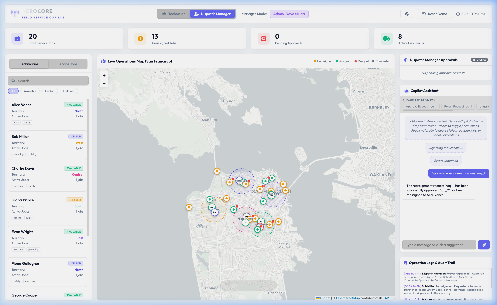
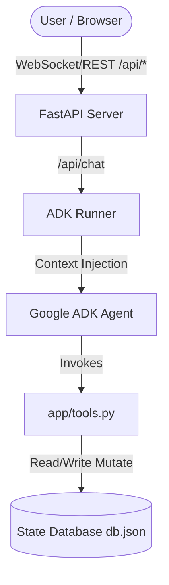
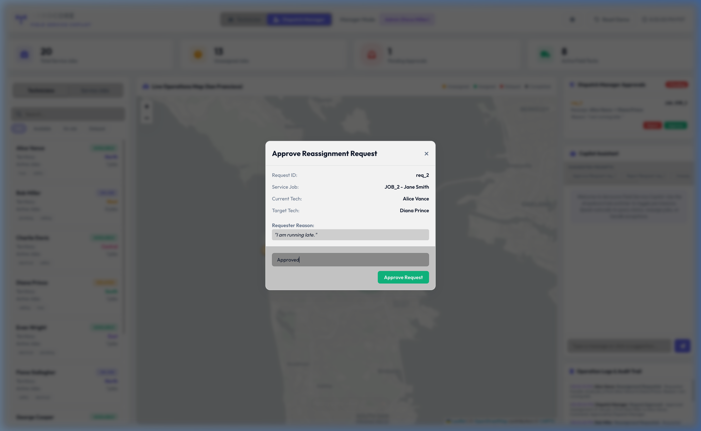
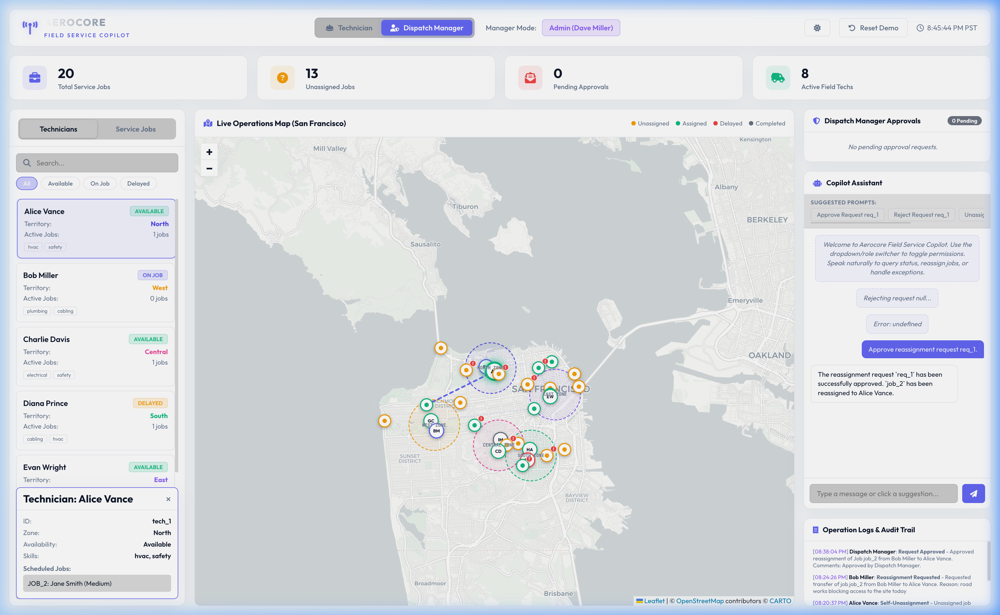

# Kaggle Capstone Project: Field Service Management Copilot

**Competition**: [Vibecoding Agents Capstone Project](https://www.kaggle.com/competitions/vibecoding-agents-capstone-project)  
**Agentic Framework**: Google Agent Development Kit (ADK) & FastAPI  
**LLM Engine**: `gemini-3.1-flash-lite`

---

## 1. Executive Summary

In field service operations, dispatcher schedules are highly dynamic. Tech exceptions—such as traffic delays, missing parts, or site inaccessibility—occur constantly. Traditional dispatch dashboards require dispatchers to manually drag-and-drop jobs, review emails, and handle exceptions. 

Our **Field Service Management Copilot** is a production-style, real-time Control Tower dashboard that overlays a natural language assistant on top of schedule mutations. Using the **Google ADK**, we implement role-aware agent capabilities:
*   **Technicians** can unassign their own jobs or submit transfer proposals.
*   **Dispatch Managers** can review, comment, and approve/reject these proposals in a queue.

All coordinates are mapped dynamically onto an interactive **Leaflet.js** map of San Francisco, supporting live line-routing, custom marker styles, and a responsive **Dark/Light Theme** switcher.



---

## 2. Agentic Architecture & Orchestration

The backend is built as a unified FastAPI application hosting the Google ADK Runner.



### Dynamic Context Injection
Rather than hardcoding authorization parameters, the agent intercepts every turn to interpolate user variables from the session state (`{user:role}` and `{user:technician_id}`) into its system instructions.

A `before_agent_callback` ensures default session variables are seeded dynamically:
```python
async def before_agent(callback_context: CallbackContext) -> None:
    if "user:role" not in callback_context.state:
        callback_context.state["user:role"] = "Technician"
    if "user:technician_id" not in callback_context.state:
        callback_context.state["user:technician_id"] = "tech_1"
```

---

## 3. ADK Tool Design & Security Schema

The agent operates under strict **Least-Privilege Role Access Control**:

```python
# app/tools.py snippet
def approve_reassignment_request(
    request_id: str, manager_comments: str = "", tool_context: ToolContext | None = None
) -> dict:
    user_role = "Dispatch Manager"
    if tool_context:
        user_role = tool_context.state.get("user:role", "Technician")

    if user_role != "Dispatch Manager":
        return {
            "status": "error",
            "message": "Permission denied. Only a Dispatch Manager can approve requests."
        }
    ...
```

### Tools Matrix
*   `get_dashboard_state`: Returns dynamic KPIs, technicians, active jobs, and log history.
*   `unassign_job_self`: Unassigns a job belonging to the caller. Excluded from managers.
*   `request_reassignment`: Technicians request job transfers to targets, adding a `Pending` request.
*   `approve_reassignment_request` / `reject_reassignment_request`: Managers resolve pending queue requests.



---

## 4. Frontend Control Tower Design

The frontend is a single-page web app styled with a modern glassmorphic dark-slate aesthetic. 

### Key Visual Features:
1.  **Leaflet.js Map Integration**: Plots San Francisco street maps using OpenStreetMap/CartoDB tiles.
2.  **Custom DIV Markers**: CSS-only pulsing marker circles representing technicians (with initials) and color-coded jobs (orange for unassigned, green for assigned, cyan for in progress, red for delayed).
3.  **Active Route Polylines**: Renders dotted lines connecting technicians to their assigned jobs, highlighting selection state in real-time.
4.  **Theme Switcher**: Instantly toggles the body stylesheet variables and shifts Leaflet tiles from `Dark Matter` to `Positron` Positron.
5.  **Dynamic Session Isolation**: The JavaScript client generates isolated session IDs for each active technician/manager profile (e.g. `session_tech_1`), ensuring conversation states remain separate.



---

## 5. Verification & Testing

The agent and web endpoints were tested via:
1.  **Quality Lints**: Passed clean Ruff, Spellcheck, and Ty checks (`agents-cli lint`).
2.  **Automated CLI Runs**: Smoke tested unassignment and permission checks:
    - Alice Vance (`tech_1`) unassigning `job_1` -> **Success (Immediate Release)**
    - Alice Vance trying to unassign Charlie's job (`job_3`) -> **Blocked (Permission Denied)**
    - Bob Miller (`tech_2`) unassigning `job_2` -> **Success**
3.  **Web Validation**: Verified that direct clicks in the Manager Approvals modal communicate with the `/api/approve_direct` REST route and trigger the state engine correctly.
