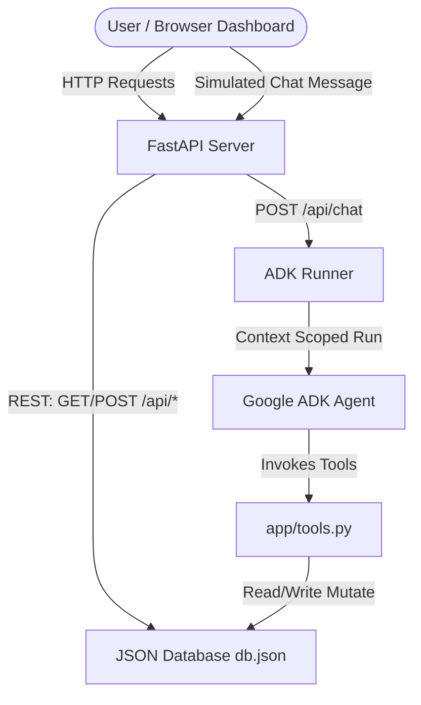

# Field Service Management Copilot Architecture Note

This document outlines the technical design, agent orchestration, tool structures, permissions architecture, and data schemas for the **Field Service Management Copilot**.

---

## 1. Architectural Overview

The system uses a unified **FastAPI** backend that orchestrates the **Google ADK Agent**, manages a local JSON database representing the operational state, and serves the static frontend dashboard.



---

## 2. Agentic Orchestration & Prompt Design

The **Google ADK Agent** is configured inside `app/agent.py`. It uses the **`gemini-3.1-flash-lite`** model for high-efficiency natural language reasoning and tool execution.

### Dynamic Context Injection
Rather than hardcoding permissions, the agent dynamically interpolates session state keys (`{user:role}` and `{user:technician_id}`) directly into its core system instructions:
- When a client sends a message, `/api/chat` updates the state variables in the ADK Session.
- The ADK runner formats the system instructions with the caller's active role.
- The model maintains strict role awareness throughout tool selection.

---

## 3. ADK Tool Contracts & Validation

Tools are implemented in `app/tools.py`. Each tool validates the calling user's identity and enforces permissions.

### Tools Matrix

| Tool Name | Parameters | Allowed Roles | Description |
|-----------|------------|---------------|-------------|
| `get_dashboard_state` | `tool_context` | All | Returns full list of jobs, technicians, pending approvals, dynamic KPIs, and logs. |
| `unassign_job_self` | `job_id`, `reason`, `tool_context` | Technician | Unassigns a job that the caller owns directly. Executes immediately. |
| `request_reassignment` | `job_id`, `target_tech_id`, `reason`, `tool_context` | Technician | Proposes reassignment to a target technician. Creates a pending approval request. |
| `approve_reassignment_request` | `request_id`, `manager_comments`, `tool_context` | Dispatch Manager | Reassigns the job, updates schedules, and marks the request "Approved". |
| `reject_reassignment_request` | `request_id`, `manager_comments`, `tool_context` | Dispatch Manager | Rejects the reassignment and records comments. |

---

## 4. Approval Workflow State Machine

The approval cycle prevents technicians from making unverified alterations to dispatch schedules:

1. **Initiation**: Technician requests reassignment of `job_id` to `target_tech_id`.
2. **Validation**: System verifies that the job is currently assigned to the requesting technician and the target technician exists.
3. **Queue Creation**: System generates a unique `request_id` (e.g. `req_1`), records the details, and flags the request as **Pending**.
4. **Manager Action**: The Dispatch Manager reviews the request.
   - **Approve**: Mutates the job's `assigned_technician_id` to the target technician, changes job status back to `Assigned`, and updates both technicians' lists of scheduled jobs.
   - **Reject**: Leaves the job assignment unchanged. Request status mutates to `Rejected`.
5. **Audit Logging**: All state mutations write directly to the `activity_log` for full compliance auditing.

---

## 5. Local Execution Guide

### Prerequisite Environment
- Python 3.11+
- `uv` package manager installed (`curl -LsSf https://astral.sh/uv/install.sh | sh`)
- Active Google GenAI API Key in `.env` file (`GEMINI_API_KEY=AIzaSy...`)

### Running the Copilot
1. Install project dependencies:
   ```bash
   agents-cli install
   ```
2. Launch the server locally:
   ```bash
   uv run python -m app.fast_api_app
   ```
3. Open your browser and navigate to:
   ```
   http://localhost:8000
   ```
